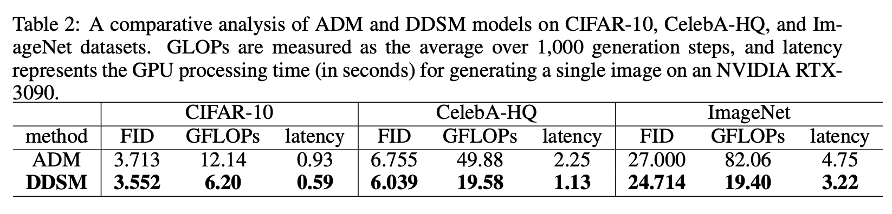
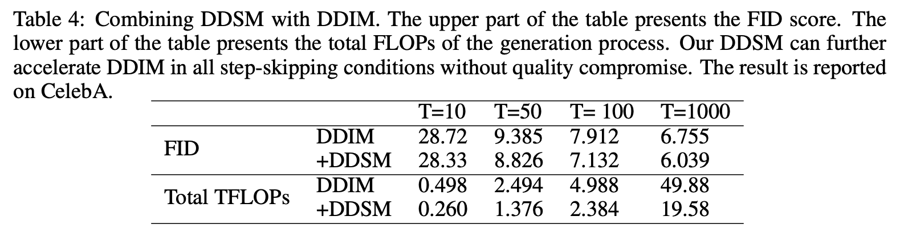

# DDSM: Denoising Diffusion Step-aware Models (ICLR 2024)

**Denoising Diffusion Step-aware Models**   
[Shuai Yang](https://scholar.google.com/citations?hl=zh-CN&user=zBHAeuUAAAAJ), [Yukang Chen](https://yukangchen.com), [Luozhou Wang](https://scholar.google.com/citations?user=FMoFIBUAAAAJ&hl=zh-CN), [Shu Liu](http://shuliu.me/), [Yingcong Chen](https://www.yingcong.me)

[[Paper]](https://arxiv.org/abs/2310.03337)

## Our Strength
* 🚀 Achieve up to **76%** reduction in computational costs for diffusion models without compromising on quality
* 🚀 Compatible with latent diffusion
* 🚀 Compatible with sampling schedulers like DDIM and EDM

## Introduction
We introduce DDSM, a novel framework optimizing diffusion models by dynamically adjusting neural network sizes per generative step, guided by evolutionary search. This method reduces computational load significantly—achieving up to 76% savings on tasks like ImageNet generation—without sacrificing generation quality.

## Install Requirements
```bash
pip install -r requirements.txt
```

## Inference and Evaluation
1. prepare the pretrained supernet and flagfile (Download [supernet checkpoint](https://drive.google.com/file/d/1yGE2jfD9ou3BtjQ6KLjDrdEFDWlVbIkR/view?usp=sharing))
2. prepare the stats of CIFAR-10 for computing FID (Download [stats file](https://drive.google.com/file/d/1uSYw17-vwGx0ewhUTnG7aUdmyPNP9ahG/view?usp=sharing))
3. run the following script
```bash
python main.py --flagfile eval/flagfile_eval.txt --notrain --eval_stepaware -parallel --batch_size 1024 --ckpt_name ckpt_450000
```

## Search
1. prepare the pretrained supernet and flagfile (Download [supernet checkpoint](https://drive.google.com/file/d/1yGE2jfD9ou3BtjQ6KLjDrdEFDWlVbIkR/view?usp=sharing))
2. run the following script
```bash
python main.py --search --flagfile work_dir/flagfile.txt --parallel --batch_size 2048 --ckpt_name ckpt_450000 \
--num_generation 10 --pop_size 50 --num_images 4096 --fid_weight 1.0 --mutation_prob 0.001
```

## Training
```bash
python main.py --train --flagfile ./config/slimmable_CIFAR10.txt --parallel --logdir=./work_dir
```

## Quantitative Results

### Results on CIFAR-10, CelebA-HQ, and ImageNet.


### Results of combining DDSM with DDIM


## Citation
If you find this project useful in your research, please consider citing:

```
@misc{yang2024denoising,
      title={Denoising Diffusion Step-aware Models}, 
      author={Shuai Yang and Yukang Chen and Luozhou Wang and Shu Liu and Yingcong Chen},
      year={2024},
      eprint={2310.03337},
      archivePrefix={arXiv},
      primaryClass={cs.CV}
}
```

## TODO

- [x] release DDSM training, search and inference code on CIFAR-10.
- [x] release checkpoints.
- [ ] make DDSM compatible with diffusers.